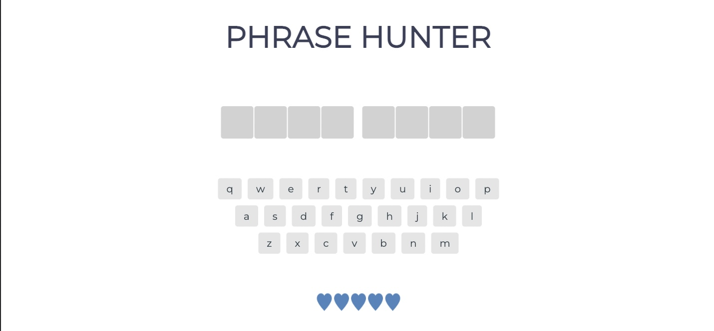
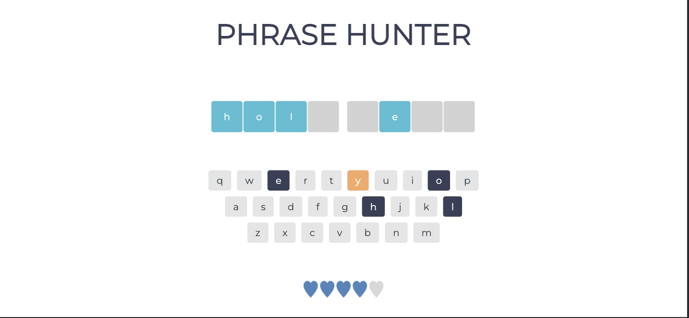
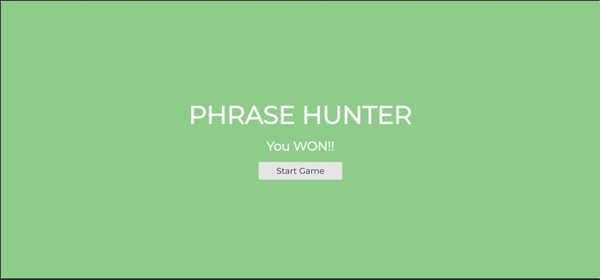

# Object Oriented JavaScript Game
## Treehouse Techdegree Project 4: Phrase Hunter

This game was built using classes and it's methods to break down the game's logic by following the Single Responsibility Principle (SRP) as much as possible.

## Technologies
* HTML
CSS
JavaScript

## Launch

Download the project files and open index.html on your browser(preferably Chrome).

The start game button functionality that’s located in app.js calls the startGame() method from the Game class, which in turn changes activePhrase from null to a random phrase generated by getRandomPhrase and displaying it on the page by using the addPhrasetoDisplay method.

By clicking on the letters displayed on the bottom of the website, the letter will be disabled and changed it’s color depending if the guessed was correct or incorrect, and it will also be displayed as many times as it appears on the phrase

You will win by unveiling all the letters of the phrase or lose if you pick the wrong letter five times 

You can play the [DEMO](https://sheilaanguiano.github.io/ooj-game/)